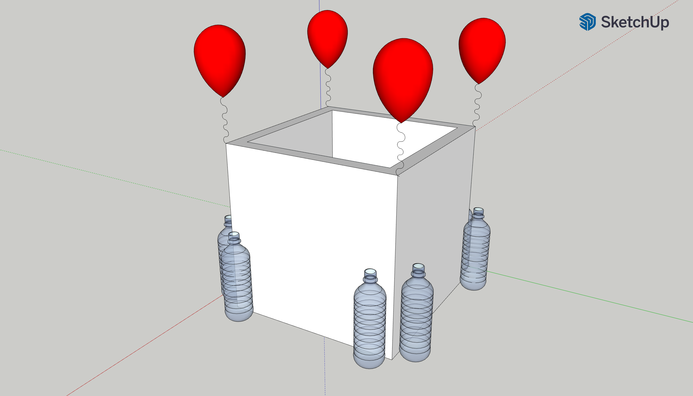

# BoatProject
CADs, Constraints, Simulations, and Derivations for the Boat Project in AP Physics 2.

<h1>1. Designing</h1>

The initial phase in the project is the designing phase. 3D CAD models for potential ideas were developed.

<b>Design 1</b>

The first design contained ideas for a bouyant container.
<ul>
<li>Materials: wood, plastic, rubber</li>
<li>Components: wood base, plastic bottles, balloons for additional floatation</li>
</ul>

<b>Design 2</b>

The second design is a basic raft.
<ul>
<li>Materials: wood/cardboard, styrofoam</li>
<li>Components: wood/cardboard base, wood/cardboard stool, styrofoam floatation device</li>
</ul>
