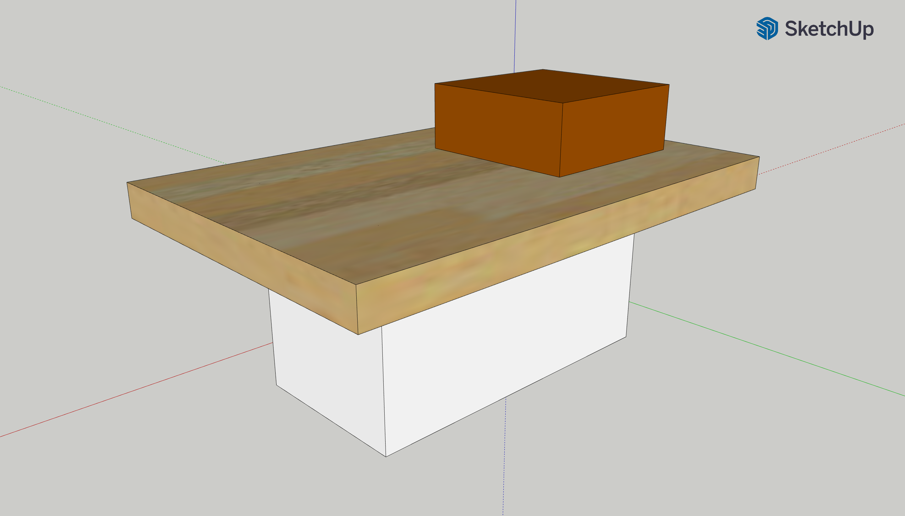

# BoatProject
CADs, Constraints, Simulations, and Derivations for the Boat Project in AP Physics 2.

<h1>1. Designing</h1>

The initial phase in the project is the designing phase. 3D CAD models for potential ideas were developed.

<b>Design 1</b>

The first design contained ideas for a bouyant container.
<ul>
<li>Materials: wood, plastic, rubber</li>
<li>Components: wood base, plastic bottles, balloons for additional floatation</li>
</ul>

<b>Design 2</b>

The second design is a basic raft.
<ul>
<li>Materials: wood/cardboard, styrofoam</li>
<li>Components: wood/cardboard base, wood/cardboard stool, styrofoam floatation device</li>
</ul>

<h1>2. Calculations</h1>

<b>Key:</b>

<code>Fb</code>: buoyant force

<code>Fg</code>: gravitational force

<code>ρ</code>: fluid density

<code>V</code>: volume (volume of submerged solid and displaced liquid are equal)

<code>m</code>: mass

<code>g</code>: gravitational constant (~10m/s/s)

<code>Fb = Fg</code>

<code>Fb = ρVg</code>

<code>Fg = mg</code>

<code>mg = ρVg</code>

<code>m = ρV</code>

<code>V = m/ρ</code>

It is assumed that the total mass of the boat and person is 70kg.
This experiment is conducted in water with a density of about 1000kg/m^3.

<code>V = 70kg / 1000kg/m^3</code>

<code>V = 0.07m^3</code>

Styrofoam density = <code>50kg/m^3</code>

<code>ρ = m / V</code>

<code>50kg/m^3 = m / 0.07m^3</code>

<code>m = 3.5kg</code>

Thus, a 3.5kg styrofoam payload is necessary to support 70kg.

In words:

<code>mass_of_styrofoam_payload = density_of_styrofoam * totoal_boat_mass / density_of_water</code>

<code>mass_of_styrofoam_payload = 50kg/m^3 * 70kg / 1000kg/m^3 = 3.5kg</code>
